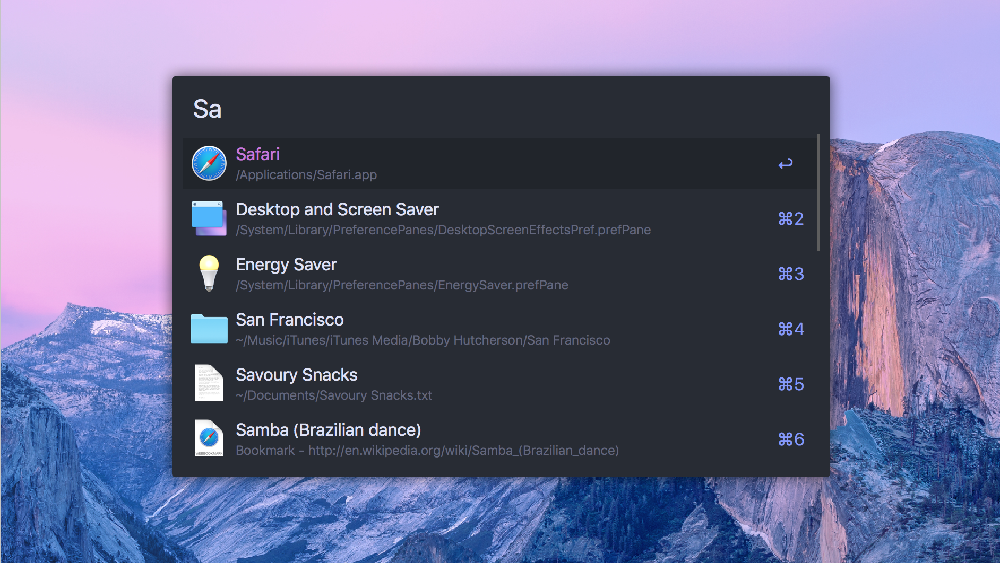
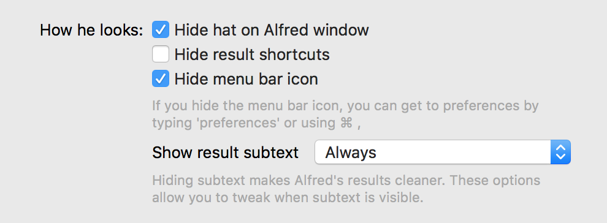

# Alfred - One Dark Theme

Based on the [Atom One Dark Theme](https://github.com/atom/one-dark-syntax).

## Install

_Requires [powerpack](https://www.alfredapp.com/powerpack/) to use custom themes_

Download as .zip and double click onedark.alfredappearance

## Options

I'm using the following options as well. You can find these at the bottom right of themes.

